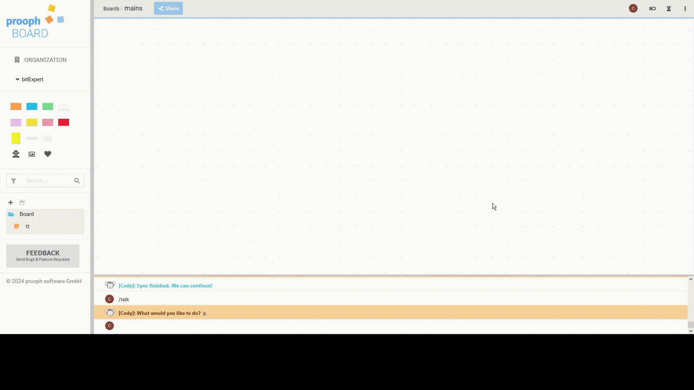
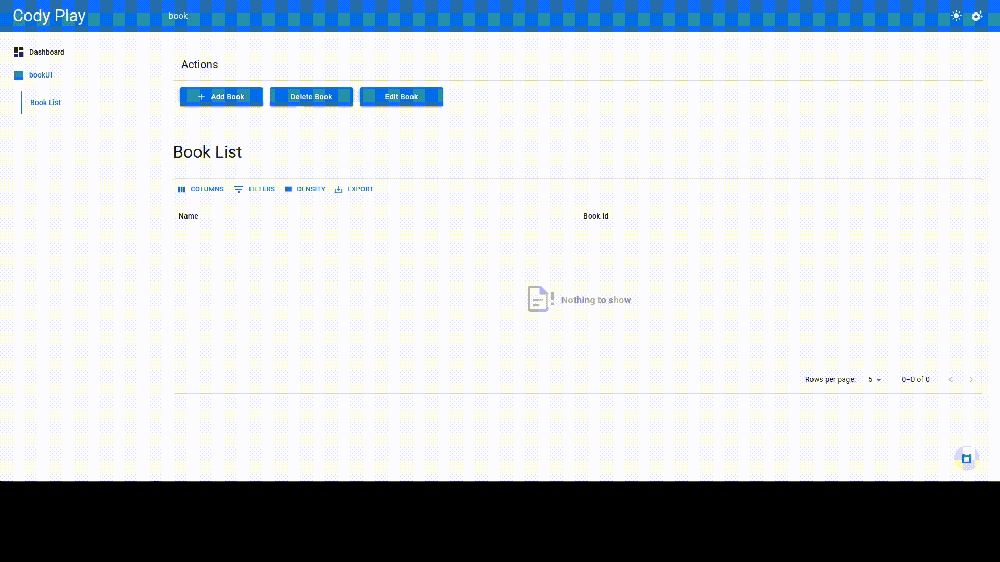
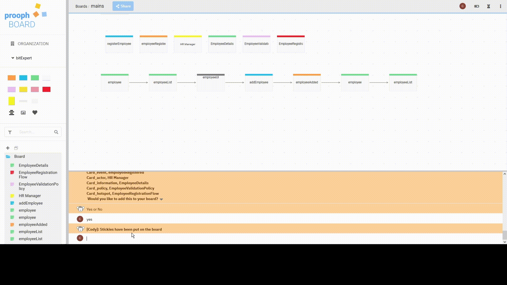
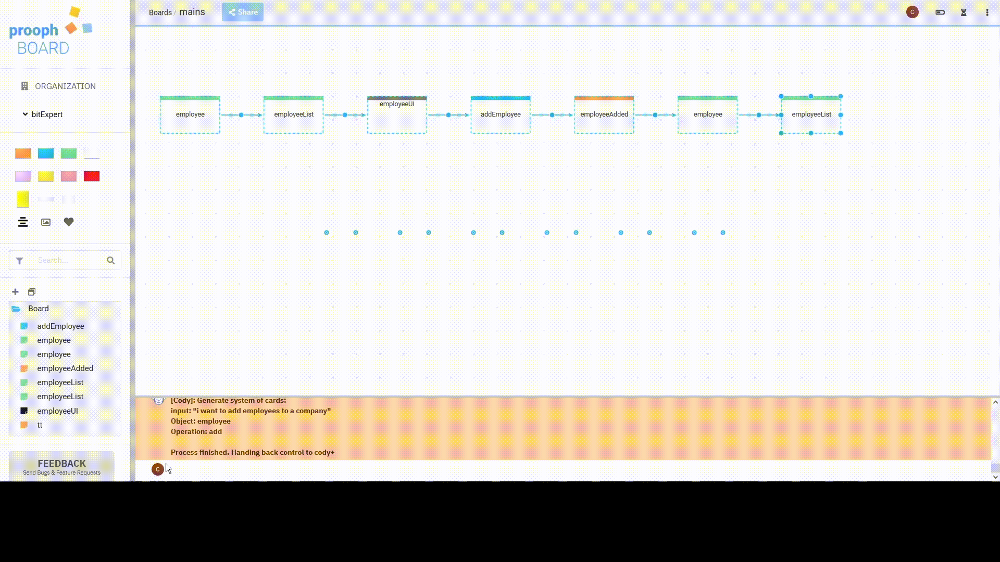

# CodyPlus - an AI Assisted Low-Code Tool Extension

This repository contains information about a Software Engineering project developed at [HS Mannheim, Germany](https://www.hs-mannheim.de/) in collaboration with [BitExpert AG](https://bitexpert.de/). The project was part of a competition where teams of students extended a low-code tool with AI capabilities, creating an AI-assistant to enhance the development process. Our team won the contest by delivering the most effective and innovative solution.

## Project Overview

This project was a simulation of a real software development process. Students worked in teams, and each team competed to create the best product. The customer in this project was BitExpert AG, while the stakeholders were the professors from HS Mannheim. Teams had to build a product under real-world conditions, with agile development practices, weekly updates, and product demonstrations.

## The Challenge

The task was to extend an existing low-code tool with an AI assistant. The main challenge was that we only had access to the code of [cody-engine](https://github.com/proophboard/cody-engine), the engine responsible for generating template code, while the main low-code platform, [proophboard](https://prooph-board.com/), was not fully available for modification. This limitation pushed us to find ways to interact with the system, leading us to use the proophboard console as the main user interface for the AI assistant.

## AI Assistant Capabilities

We integrated the Codestral AI, a locally hosted AI, as the brain behind the assistant. The system was designed to be flexible, allowing easy replacement of the AI API schema.

## Addressing the User Experience

While interacting through the console offered flexibility, it also posed a challenge for user experience (UX). To overcome this, we designed a UI-prototype that provided a visual solution to simplify command-based interactions. This prototype streamlined the process, offering users a more intuitive and user-friendly interface for executing commands.

## Development Environment
### Key Technologies:

  - Node.js
  - TypeScript
  - npm

## Available Commands

- **/create**:  
Creates a feature based on a short explanation.

- **/createPlus**:   
Creates three features (add, delete, edit) based on a short explanation.  
This feature is fully executable.

- **/events**:  
Creates event cards based on a short sentence provided by the user.

- **/tip**:  
Suggests cards based on existing cards.

- **/multiCreate**:   
Creates a functioning system based on a short explanation.
- **/hotSpots**:   
Identifies potential problems based on existing cards.
- **/flows**:  
Suggests card connections based on existing cards.
- **/suggest**:   
Suggests additional cards based on one event card.
- **/ai**:   
Chat with the AI assistant.
- **/end**:   
Ends the conversation and saves it.
- **/history**:   
Lists past conversations and allows users to revisit them.
- **/delete**:   
Deletes all past conversations.
- **/commands**:   
Lists all available commands with descriptions.

## Development Process
### Agile Methodology

We used agile methodologies throughout the project. Key highlights of our development process include:  
- Daily Stand-ups:
To stay aligned as a team, we held daily meetings to discuss progress, roadblocks, and next steps.
- Weekly Jour Fixes:
We presented our progress to the stakeholders every week, receiving feedback and adjusting our development roadmap accordingly.
- Sprints and Retrospectives:
Each sprint was followed by a retrospective, where we analyzed what went well and what needed improvement.

## Version Control

We used Git for version control, following best practices for collaboration, including frequent commits, branches for new features, and proper code reviews before merging.
## Conclusion

Our solution successfully addressed the challenges posed by the competition and extended the capabilities of the proophboard low-code platform with a powerful AI assistant. Thanks to the assistant’s ability to automate code generation and system creation based on simple user commands, our team won the contest.
